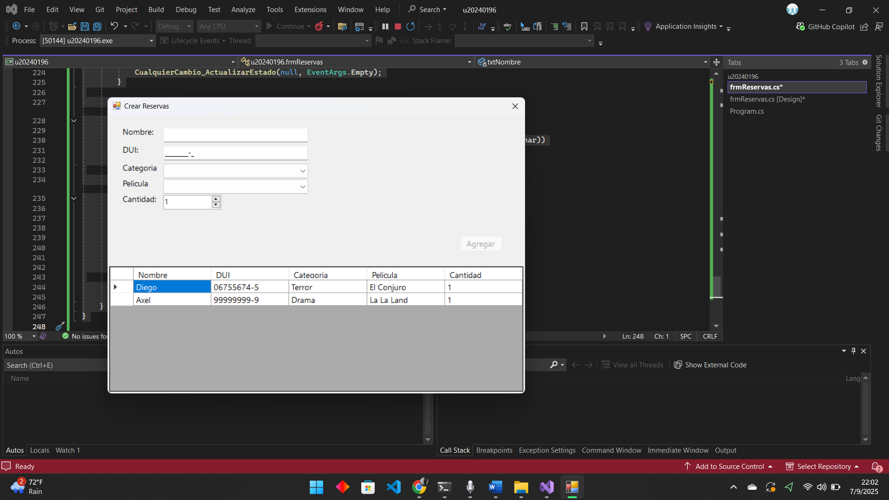

# Parcial 1 - Programación Orientada a Eventos (POE)

**Alumno:** Diego Molina  
**Código:** U20240196  
**Materia:** POE - Ingeniería en Desarrollo de Software  
**Autoevaluación:** 8.5/10  

---

## 📌 Descripción
Este proyecto corresponde al **Parcial I de POE**.  
Se implementa un sistema de **Reserva de Boletos de Cine** en Windows Forms (C# .NET Framework).

El formulario principal (`frmReservas`) permite:
- Ingresar **Nombre** y **DUI** (con máscara).  
- Seleccionar **Categoría** de película y mostrar la lista de **películas dinámicas**.  
- Indicar la **cantidad de boletos**.  
- Validar campos antes de agregar.  
- Registrar la reserva en un **DataGridView**.  
- Botón *Agregar* que se habilita solo cuando todos los campos están completos (bonus).

---

## ⚙️ Tecnologías utilizadas
- C# (Windows Forms, .NET Framework 4.7.2)  
- Visual Studio 2022  
- GitHub para control de versiones  

---

## 📸 Captura de ejemplo
Ejemplo de una reserva registrada en el sistema:  

---

## 🚀 Ejecución
1. Clonar el repositorio o descargar ZIP.  
2. Abrir el proyecto en **Visual Studio 2022**.  
3. Compilar y ejecutar (`Start`).  

---
